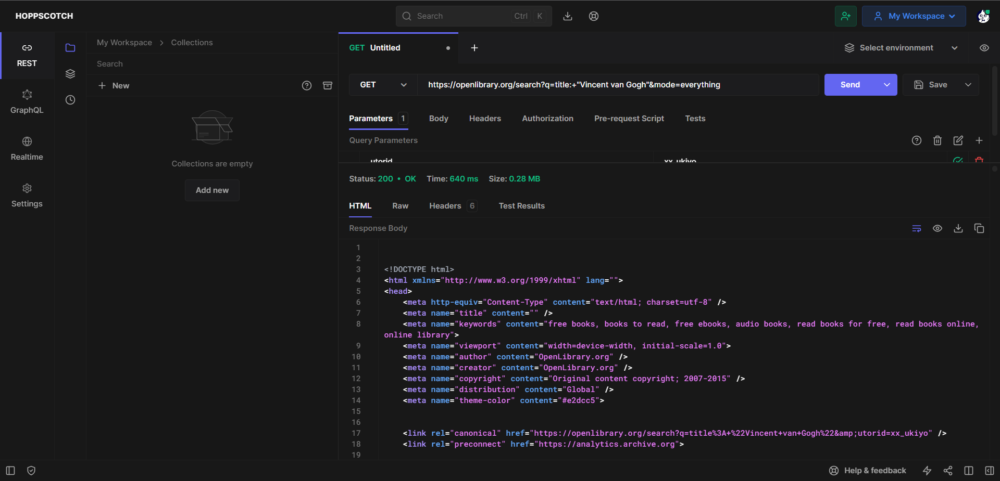
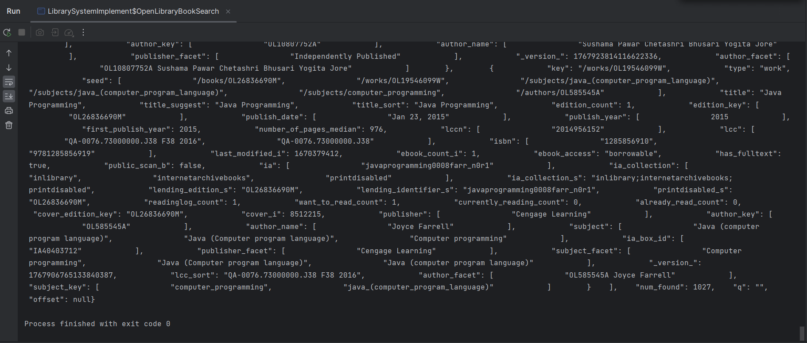

# Week 3 Project - Library Management System

## Problem Domain
Our project centers around the development of a library management system, offering comprehensive solutions for library administrators and patrons alike. This domain encompasses various aspects of library operations, including:

## High-Level Description
Our team is dedicated to creating a user-friendly library management application that simplifies key aspects of library operations and enhances the overall library experience. This application will offer the following core functionalities:

- **Catalog Management:** A robust system for librarians to add, update, and organize library materials, making it easier for patrons to find what they need.

- **User Management:** An intuitive interface for managing library member accounts, including registration, access control, and communication.

Our library management system aims to provide library staff with the tools they need to manage their collections efficiently while ensuring library users have a seamless experience accessing and browsing materials.

## External Library APIs
To enrich our library management system, we plan to integrate external library APIs for accessing book data, including information about authors, titles, and publication dates. We will utilize the "LibraryData API" to achieve this goal. You can find detailed API documentation: https://openlibrary.org/developers/api

## API Testing
Below is a screenshot illustrating the use of Hoppscotch to test the LibraryData API for retrieving book information by using the key words "Vincent van Gogh":

## Example Output
Here is a minimal Java code example demonstrating how our application will interact with the LibraryData API to fetch book details:

